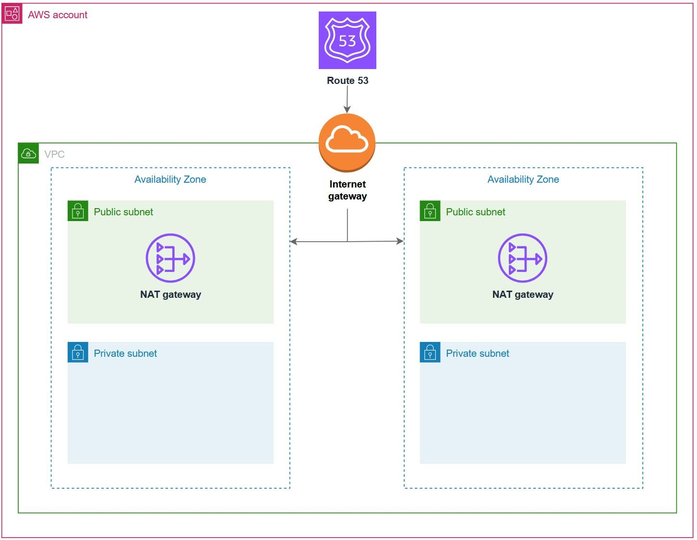
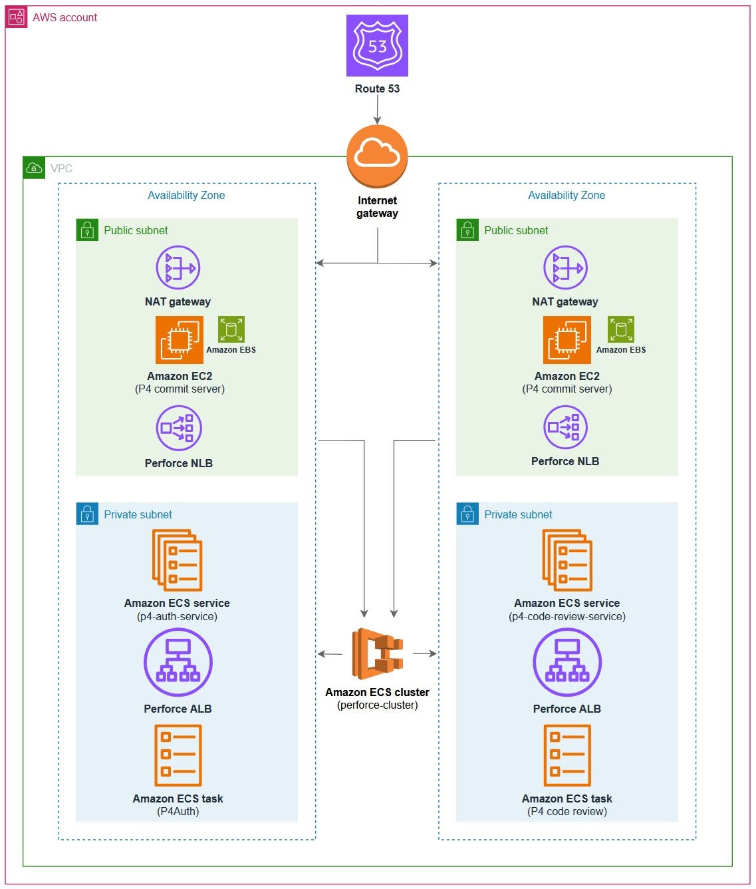
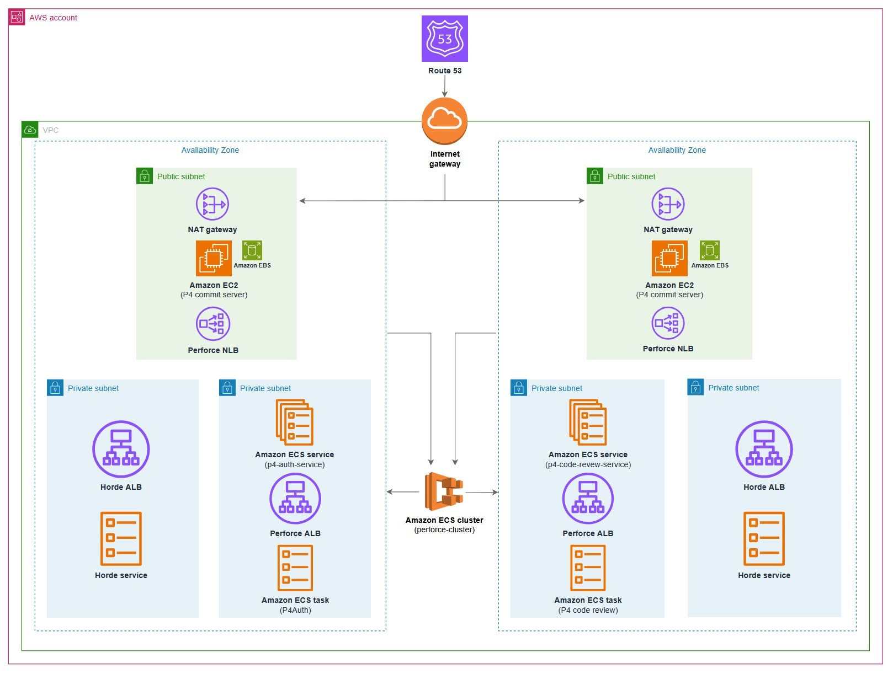

# HỖ TRỢ PHÁT TRIỂN TRÒ CHƠI VỚI AWS CLOUD GAME DEVELOPMENT TOOLKIT

## Giới thiệu

Trong quá trình phát triển trò chơi, các studio thường gặp nhiều khó khăn trong việc xây dựng hệ thống quản lý mã nguồn, tự động hóa quy trình build và triển khai hạ tầng. Đối với các nhóm phát triển từ xa hoặc các dự án có quy mô lớn, việc tự xây dựng và vận hành hạ tầng không chỉ tốn nhiều thời gian mà còn làm tăng chi phí.

Để giải quyết vấn đề này, AWS đã phát triển **Cloud Game Development Toolkit**. Đây là một bộ công cụ mã nguồn mở cung cấp sẵn các mẫu cấu hình **Terraform** và **Packer**, giúp các studio trò chơi nhanh chóng triển khai môi trường phát triển trên AWS, rút ngắn thời gian thiết lập từ nhiều tuần xuống chỉ còn vài giờ.

## Những thách thức trong phát triển trò chơi

Việc xây dựng một dự án trò chơi hiện đại thường gặp nhiều khó khăn như:

- Thời gian build kéo dài và dễ phát sinh lỗi.
- Việc quản lý khối lượng lớn tài nguyên của trò chơi còn nhiều hạn chế.
- Khó khăn trong quá trình cộng tác giữa các thành viên làm việc ở nhiều địa điểm khác nhau.
- Thiếu hệ thống quản lý phiên bản và quy trình CI/CD phù hợp cho các dự án quy mô lớn.
- Chi phí đầu tư phần cứng và vận hành hạ tầng cao.

## Giải pháp với AWS Cloud Game Development Toolkit

Cloud Game Development Toolkit cung cấp đầy đủ các thành phần cần thiết để xây dựng môi trường phát triển trò chơi trên AWS.

### 1. Quản lý mã nguồn với Perforce

Bộ công cụ hỗ trợ triển khai nhanh hệ thống **Perforce P4** trên AWS, bao gồm:

- Máy chủ Perforce chạy trên **Amazon EC2** và lưu trữ dữ liệu bằng **Amazon EBS**.
- Dịch vụ xác thực và đánh giá mã nguồn chạy trên **Amazon ECS**.
- Tự động cấu hình xác thực và kết nối cho nhóm phát triển.

Nhờ đó, các thành viên trong nhóm có thể dễ dàng chia sẻ tài nguyên, quản lý phiên bản và cộng tác hiệu quả hơn.

### 2. Tăng tốc quy trình Build với Horde

Đối với các dự án sử dụng **Unreal Engine**, bộ công cụ hỗ trợ triển khai **Unreal Engine Horde** – hệ thống **CI/CD** chuyên dụng dành cho phát triển trò chơi.

Các tính năng nổi bật bao gồm:

- Tự động hóa quy trình build và kiểm thử.
- Hỗ trợ các **Build Agent** có khả năng tự động mở rộng theo nhu cầu.
- Tích hợp trực tiếp với **Perforce**.
- Cung cấp giao diện trực quan để theo dõi và quản lý các phiên build.
- Hỗ trợ **Unreal Build Accelerator** nhằm tăng tốc quá trình biên dịch.

### 3. Kiến trúc giải pháp trên AWS

Cloud Game Development Toolkit tận dụng nhiều dịch vụ của AWS như:

- **Amazon VPC** và **Amazon Route 53** để xây dựng hạ tầng mạng.
- **Amazon EC2** và **Amazon EBS** để vận hành máy chủ xử lý chính.
- **Amazon ECS** để chạy các dịch vụ container.
- **Amazon DocumentDB** và **Amazon ElastiCache** nhằm hỗ trợ hệ thống Horde.
- **AWS Certificate Manager** để quản lý chứng chỉ bảo mật.

Toàn bộ hạ tầng được triển khai theo mô hình **Infrastructure as Code (IaC)**, giúp việc quản lý, mở rộng và tái sử dụng trở nên đơn giản và hiệu quả hơn.

## Lợi ích của Cloud Game Development Toolkit

Cloud Game Development Toolkit mang lại nhiều lợi ích cho các studio phát triển trò chơi, bao gồm:

- Triển khai hạ tầng nhanh chóng chỉ trong vài giờ.
- Tự động áp dụng các **AWS Best Practices**.
- Dễ dàng mở rộng khi quy mô dự án tăng lên.
- Tối ưu chi phí thông qua **Auto Scaling** và **Amazon EC2 Spot Instances**.
- Giúp nhóm phát triển tập trung vào việc xây dựng trò chơi thay vì quản lý hạ tầng.

## Tổng kết

Thông qua **Cloud Game Development Toolkit**, AWS giúp các studio trò chơi xây dựng một môi trường phát triển hiện đại, linh hoạt và tiết kiệm chi phí. Bộ công cụ này góp phần rút ngắn thời gian triển khai hạ tầng, tối ưu quy trình phát triển và đẩy nhanh quá trình đưa sản phẩm ra thị trường.

**Link tham khảo:** https://aws.amazon.com/vi/blogs/gametech/game-development-infrastructure-simplified-with-aws-game-dev-toolkit/