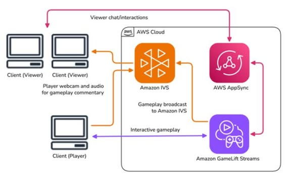
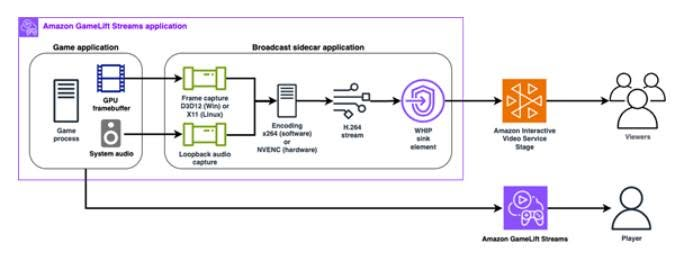

# CHUYỂN ĐỔI NGƯỜI XEM THÀNH NGƯỜI CHƠI VỚI AMAZON GAMELIFT STREAMS

## Giới thiệu

Trong bài viết này, tôi sẽ giới thiệu cách AWS giải quyết bài toán **Interactive Streaming** – biến trải nghiệm xem livestream trò chơi một chiều thành trải nghiệm tương tác hai chiều theo thời gian thực.

Trong quá trình phát triển trò chơi, việc tổ chức các buổi **Playtest** thường tốn nhiều thời gian do phải chuẩn bị bản build, thiết lập môi trường và xem lại video để đánh giá kết quả. Đồng thời, việc tương tác với cộng đồng người xem cũng còn nhiều hạn chế khi họ chỉ có thể trò chuyện thông qua khung chat.

Để giải quyết vấn đề này, AWS đã giới thiệu một kiến trúc kết hợp nhiều dịch vụ nhằm mang đến khả năng phát trực tiếp và tương tác theo thời gian thực.

## Ba thành phần chính của kiến trúc

### Amazon GameLift Streams

Amazon GameLift Streams cho phép phát trực tiếp trò chơi từ máy chủ đến trình duyệt thông qua giao thức **WebRTC** với độ trễ rất thấp. Người chơi có thể trải nghiệm trò chơi ở chất lượng lên đến **1080p, 60 FPS** mà không cần tải xuống hoặc cài đặt game.

### Amazon IVS (Interactive Video Service)

Amazon IVS tiếp nhận luồng phát từ trò chơi và phân phối đến người xem trên phạm vi toàn cầu với độ trễ chỉ dưới một giây.

### AWS AppSync

AWS AppSync đóng vai trò là cầu nối giữa người xem và trò chơi, cung cấp **WebSocket API** để truyền ngay lập tức các tin nhắn, biểu tượng cảm xúc (reactions) và lệnh điều khiển từ người xem vào trong trò chơi.

## Quy trình hoạt động của kiến trúc

Quy trình hoạt động của hệ thống diễn ra như sau:

1. Người dùng truy cập giao diện React và được xác thực an toàn thông qua **Amazon Cognito**.

2. **Amazon API Gateway** kết hợp với **AWS Lambda** tiếp nhận yêu cầu và khởi tạo phiên phát trực tiếp.

3. Trên máy chủ, **Amazon GameLift Streams** chạy trò chơi và đồng thời khởi động một tiến trình nền có tên là **Broadcast Sidecar**.

4. Ứng dụng **Broadcast Sidecar** sẽ ghi hình và âm thanh của trò chơi, mã hóa video bằng chuẩn **H.264**, sau đó truyền trực tiếp luồng phát lên **Amazon IVS** với độ trễ dưới **300 ms**.

## Điểm nổi bật về kỹ thuật: Cơ chế "Control Handoff"

Một trong những điểm nổi bật nhất của giải pháp là cơ chế **Control Handoff**, cho phép chuyển quyền điều khiển trò chơi giữa các người tham gia.

Hệ thống sử dụng **AWS AppSync Event API** để đồng bộ trạng thái điều khiển thông qua các sự kiện như:

- **TAKEOVER_REQUEST:** Gửi yêu cầu nhận quyền điều khiển từ người chơi hiện tại.
- **TAKEOVER_APPROVED:** Chấp thuận yêu cầu và bắt đầu chia sẻ phiên chơi thông qua **CreateStreamSessionConnection API**.

Nhờ cơ chế này, việc chuyển quyền điều khiển giữa nhiều người dùng diễn ra nhanh chóng và mượt mà.

## Tổng kết

Kiến trúc này không chỉ giúp tối ưu hóa quá trình **Playtest** trong các studio phát triển trò chơi mà còn mở ra nhiều cơ hội mới cho các hoạt động truyền thông và xây dựng cộng đồng.

Người xem có thể trực tiếp tham gia vào trò chơi ngay trên trình duyệt, chẳng hạn như bỏ phiếu quyết định hướng đi của nhân vật, tạo quái vật hoặc thực hiện các hành động tương tác khác mà vẫn đảm bảo độ trễ thấp và trải nghiệm mượt mà.

**Link tham khảo:** https://aws.amazon.com/blogs/gametech/creating-interactive-gaming-experiences-with-amazon-gamelift-streams-and-amazon-interactive-video-service/