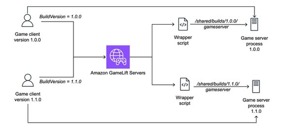

# ACCELERATE GAME DEVELOPMENT WITH MULTI-BUILD ON AMAZON GAMELIFT SERVERS

**Introduction**

In online game development, updating and testing multiple game server versions is a frequent occurrence. However, deploying each new version to the infrastructure can be time-consuming and impact the testing process.

AWS has introduced the Multi-Build solution on Amazon GameLift Servers, allowing developers to host and operate multiple game server versions on the same fleet, accelerating game development and testing.

**What is Amazon GameLift Servers?**

Amazon GameLift Servers is a game server hosting service fully managed by AWS. This service helps developers deploy, manage, and scale game server systems globally.

Many major game titles on the market have used GameLift to ensure scalability and stability for millions of players.

**Problems in game development**

* Typically, every time a new server version is released, developers have to:
    * Rebuild the server.
    * Redeploy to infrastructure.
    * Test and verify functionality.
    * Switch between versions when testing is needed.

This process is quite time-consuming, especially during Alpha and Beta phases when updates are continuous.

**Multi-Build Solution**

Multi-Build is a solution that allows hosting multiple game server instances on the same Amazon GameLift fleet.

* Instead of redeploying the entire system, developers only need to:
    * Upload the new version to Amazon S3.
    * The system automatically synchronizes to the GameLift servers.
    * When creating a Game Session, specify the BuildVersion to use.
    * The server will automatically start with the corresponding version.

This makes switching between versions faster and more flexible.

**Operating Architecture**

The solution uses two main containers:

**1. Game Server Container**

* This container is responsible for:
    * Running the game server.
    * Receiving requests to create game sessions.
    * Start the correct server version according to BuildVersion.

**2. S3 Sync Container**

* This container runs continuously in the background:
    * Checks for changes on Amazon S3.
    * Synchronizes new builds.
    * Delete old builds that are no longer in use.
    * Ensures data is fully downloaded before execution.

The two containers share a common directory to access synchronized builds.

**AWS Services Used**

* The Multi-Build solution combines multiple AWS services:
    * Amazon GameLift Servers
    * Amazon S3
    * Amazon ECR
    * AWS IAM
    * AWS CodeBuild
    * AWS CloudFormation
    * Amazon CloudWatch Logs

This allows for almost complete automation of the deployment and management process.

**Benefits of Multi-Build**

**Increased development speed**

Development teams can test multiple game versions simultaneously without redeploying the fleet.

**Time Savings**

Uploading a new build only takes a few minutes instead of going through the full deployment process.

**Alpha and Beta Testing Support**

Multiple game versions can coexist to serve different test groups.

**Easy Management**

Builds are centrally managed on Amazon S3 and automatically synchronized to servers.

**SUMMARY**

Amazon GameLift Servers Multi-Build is a useful solution for game development teams looking to accelerate testing and new version releases. By allowing multiple builds to coexist on a single fleet, AWS significantly reduces deployment time and optimizes the game development process.

For game projects in the Alpha, Beta, or new feature development stages, this is a solution worth exploring and implementing.

**Link:** https://aws.amazon.com/vi/blogs/gametech/rapid-game-server-iteration-on-amazon-gamelift-servers/